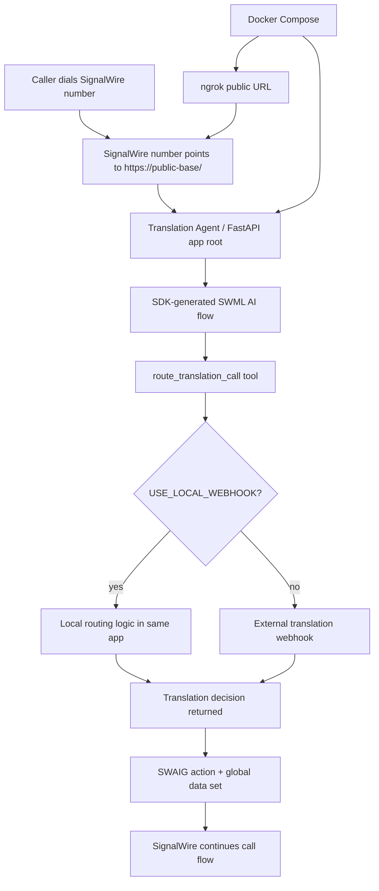

# Real-Time-Translation-AI-Agent

Real-time translation AI agent orchestrator built with Python, `uv`, FastAPI, and the SignalWire Agents SDK.

## MVP shape

For the MVP, everything runs in one backend service:

- SignalWire-facing agent endpoint
- local webhook decision logic inside the same backend
- routing/orchestration logic
- structured logs
- optional ngrok tunnel via Docker Compose

This keeps the first demo simple while preserving a clean contract for splitting services later.

## High-level flow



## What this app does

- exposes a SignalWire-compatible agent endpoint
- answers incoming calls through SignalWire Agents SDK
- confirms source and target languages
- triggers a translation-routing tool (`route_translation_call`)
- calls local in-process webhook logic for routing decisions by default
- can later call an external webhook without changing the SignalWire-facing contract
- logs routing decisions clearly for debugging/demo purposes

## Endpoints

- `GET /health`
- `GET /ready`
- `GET /` and `POST /` → SDK-generated SWML entrypoint for inbound SignalWire traffic
- `GET /sip` and `POST /sip` → same SDK-generated SWML entrypoint, used by the LaML compatibility shim
- `GET /laml` and `POST /laml` → XML compatibility shim that redirects SignalWire to `/sip`
- `POST /swaig` → SWAIG tool calls
- `POST /post_prompt` → post-call AI callback

## Local development

```bash
uv sync
cp .env.example .env
uv run python -m real_time_translation_ai_agent.main
```

## Docker Compose

```bash
cp .env.example .env
# fill in SIGNALWIRE_TOKEN and NGROK_AUTHTOKEN
docker compose up --build
```

That starts:
- the backend on port `3001`
- ngrok on port `4040` for the local inspection API

To inspect the public ngrok URL:

```bash
curl -s http://localhost:4040/api/tunnels | jq
```

Use the resulting `https://...ngrok...` URL as the public base URL for SignalWire.
Recommended SDK-native setup: point the SignalWire phone number webhook directly to `https://...ngrok.../`.
Compatibility setup: if direct root handling is flaky for a PSTN number, point the number to `https://...ngrok.../laml`; the shim redirects to `/sip`, which renders the same SDK SWML.

## Example calls

### Fetch SWML

```bash
curl -s http://localhost:3001/ | jq
```

### Call SWAIG routing tool

```bash
curl -s http://localhost:3001/swaig \
  -H 'content-type: application/json' \
  -d '{
    "function": "route_translation_call",
    "call_id": "demo-call-123",
    "argument": {"raw": "{\"source_language\":\"en-US\",\"target_language\":\"es-ES\"}"}
  }' | jq
```

### Run the local contract smoke test

```bash
uv run python scripts/smoke_contract.py
```

This verifies the health endpoint, root `/` SDK SWML, `/sip`, `/laml`, public callback URL rewriting for ngrok-style forwarded headers, and both raw + parsed SWAIG argument formats.

## Logging

Supported log env vars:

- `LOG_LEVEL=DEBUG|INFO|WARNING|ERROR`
- `LOG_FORMAT=pretty|json`

`pretty` is nicer for local development.
`json` is better for ingestion in hosted environments.

## SignalWire number config

- Preferred: configure the inbound webhook URL as `https://<public-base>/`
- Fallback/compatibility: configure the inbound webhook URL as `https://<public-base>/laml`, which returns XML redirecting to `/sip`
- After every ngrok URL change, update both `PUBLIC_BASE_URL` and the SignalWire phone-number webhook URL
- Verify live `GET/POST /`, `GET/POST /sip`, and `GET/POST /laml` before placing another inbound PSTN test call

## Recommended MVP env

```env
SIGNALWIRE_SPACE=webrtcventures.signalwire.com
SIGNALWIRE_PROJECT=3e85ab51-d514-409d-bfcd-211997ae7fbb
SIGNALWIRE_TOKEN=...
SWML_BASIC_AUTH_USER=signalwire
SWML_BASIC_AUTH_PASSWORD=<strong-password>
NGROK_AUTHTOKEN=...
USE_LOCAL_WEBHOOK=true
DEFAULT_SOURCE_LANGUAGE=en-US
DEFAULT_TARGET_LANGUAGE=es-ES
```

## Architecture note

Current recommendation for MVP:

- SignalWire handles call/media infra
- this service handles orchestration
- the translation routing contract currently lives as local in-process webhook logic
- later we can move that same contract into a separate HTTP webhook service if needed
