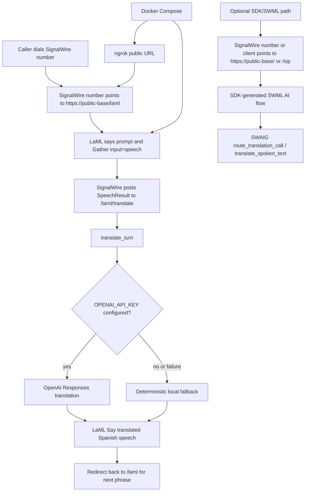

# Real-Time-Translation-AI-Agent

Real-time translation AI agent orchestrator built with Python, `uv`, FastAPI, OpenAI Responses, SignalWire LaML, and the SignalWire Agents SDK.

## MVP shape

For the MVP, everything runs in one backend service:

- SignalWire-facing agent endpoint
- local webhook decision logic inside the same backend
- routing/orchestration logic
- structured logs
- optional ngrok tunnel via Docker Compose

This keeps the first demo simple while preserving a clean contract for splitting services later.

## High-level flow

There are two entrypoints in the current MVP:

- **Live PSTN demo path:** SignalWire LaML gathers whatever the caller says, translates that captured utterance with OpenAI, speaks the Spanish result back, then loops for the next utterance.
- **SDK/SWML orchestration path:** the SignalWire Agents SDK endpoint remains available for the richer agent-oriented call flow and SWAIG tool routing.

The live path is turn-by-turn real-time translation. The service does not use a scripted phrase or pre-known caller text; it receives `SpeechResult` from SignalWire for each spoken phrase and translates that text directly.



## What this app does

- exposes a SignalWire-compatible agent endpoint
- answers incoming calls through SignalWire Agents SDK
- exposes a LaML live speech loop for PSTN calls
- captures arbitrary caller speech through SignalWire `Gather input="speech"`
- translates each captured utterance with OpenAI Responses when `OPENAI_API_KEY` is configured
- speaks the translated text back with Spanish LaML `<Say language="es-ES">`
- confirms source and target languages
- triggers a translation-routing tool (`route_translation_call`)
- calls local in-process webhook logic for routing decisions by default
- can later call an external webhook without changing the SignalWire-facing contract
- logs routing decisions clearly for debugging/demo purposes

## Endpoints

- `GET /health`
- `GET /ready`
- `GET /` and `POST /` → SDK-generated SWML entrypoint for inbound SignalWire traffic
- `GET /sip` and `POST /sip` → same SDK-generated SWML entrypoint for SIP/WebRTC-compatible clients
- `GET /laml` and `POST /laml` → LaML XML entrypoint that prompts the caller and gathers arbitrary English speech
- `GET /laml/translate` and `POST /laml/translate` → receives SignalWire `SpeechResult`, translates it, speaks Spanish audio back, then redirects to `/laml`
- `POST /api/demo/session` → returns a realistic PSTN or WebRTC demo session descriptor
- `POST /api/demo/live-call` → simulates a multi-turn live call transcript before a real call
- `POST /api/translate` → turn translation endpoint; uses external webhook or OpenAI when configured, then deterministic fallback
- `POST /swaig` → SWAIG tool calls
- `POST /post_prompt` → post-call AI callback

## Local development

```bash
uv sync
cp .env.example .env
uv run python -m real_time_translation_ai_agent.main
```

## Docker Compose

```bash
cp .env.example .env
# fill in SIGNALWIRE_TOKEN and NGROK_AUTHTOKEN
docker compose up --build
```

That starts:
- the backend on port `3001`
- ngrok on port `4040` for the local inspection API

To inspect the public ngrok URL:

```bash
curl -s http://localhost:4040/api/tunnels | jq
```

Use the resulting `https://...ngrok...` URL as the public base URL for SignalWire.
Recommended live PSTN setup: point the SignalWire phone number webhook directly to `https://...ngrok.../laml`.
SDK-native setup: point an SDK/SWML client or compatible SignalWire number webhook to `https://...ngrok.../` or `https://...ngrok.../sip`.

For the live PSTN path, configure `OPENAI_API_KEY` and set `LLM_MODEL` to the translation model you want to use. If OpenAI is not configured or the API call fails, the call remains alive and falls back to the local deterministic phrasebook/tagged response path.

## Example calls

### Fetch SWML

```bash
curl -s http://localhost:3001/ | jq
```

### Call SWAIG routing tool

```bash
curl -s http://localhost:3001/swaig \
  -H 'content-type: application/json' \
  -d '{
    "function": "route_translation_call",
    "call_id": "demo-call-123",
    "argument": {"raw": "{\"source_language\":\"en-US\",\"target_language\":\"es-ES\"}"}
  }' | jq
```

### Run the local contract smoke test

```bash
uv run python scripts/smoke_contract.py
```

This verifies the health endpoint, root `/` SDK SWML, `/sip`, `/laml`, `/laml/translate`, public callback URL rewriting for ngrok-style forwarded headers, OpenAI translation payload handling with a mocked client, and both raw + parsed SWAIG argument formats.

### Exercise the live LaML translation loop

Use this to simulate what SignalWire posts after a caller says an arbitrary phrase. The text in `SpeechResult` is the actual recognized utterance for this turn.

```bash
curl -s http://localhost:3001/laml/translate \
  -H 'content-type: application/x-www-form-urlencoded' \
  --data-urlencode 'SpeechResult=Please transfer me to billing because my card was charged twice.' \
  --data-urlencode 'CallSid=demo-call-123'
```

With `OPENAI_API_KEY` configured, the XML response contains a Spanish `<Say>` for the translated utterance and a `<Redirect>` back to `/laml` so the next phrase can be captured. This is the path to test when verifying that the app translates unknown, unscripted caller speech.

### Exercise the turn translation endpoint

```bash
curl -s http://localhost:3001/api/translate \
  -H 'content-type: application/json' \
  -d '{
    "text": "I need help with my reservation.",
    "source_language": "en-US",
    "target_language": "es-ES",
    "source_language_label": "English",
    "target_language_label": "Spanish"
  }' | jq
```

The MVP exposes the same turn translation contract outside the phone loop. With `OPENAI_API_KEY` configured, unknown phrases are translated through OpenAI Responses. Without OpenAI, known phrases resolve from a small phrasebook and unknown phrases fall back to a stable tagged response so local demos and tests stay reliable without paid translation providers.

### Generate a live-call demo session

```bash
curl -s http://localhost:3001/api/demo/session \
  -H 'content-type: application/json' \
  -d '{
    "transport": "pstn",
    "source_language": "en-US",
    "target_language": "es-ES",
    "source_language_label": "English",
    "target_language_label": "Spanish"
  }' | jq
```

This returns a session descriptor with the SWML URL, `/sip` webhook, `/laml` live PSTN URL, translation endpoint, and a short operator checklist for either PSTN or WebRTC demos.

### Simulate a live call before dialing

```bash
curl -s http://localhost:3001/api/demo/live-call \
  -H 'content-type: application/json' \
  -d '{
    "transport": "webrtc",
    "source_language": "en-US",
    "target_language": "es-ES",
    "source_language_label": "English",
    "target_language_label": "Spanish",
    "turns": [
      {"speaker": "caller", "text": "hello"},
      {"speaker": "caller", "text": "Please transfer me to billing."},
      {"speaker": "callee", "text": "hola"}
    ]
  }' | jq
```

This gives you a deterministic transcript and event log for the same call path the live demo is expected to follow, which makes PSTN/WebRTC regressions much easier to spot.

## Logging

Supported log env vars:

- `LOG_LEVEL=DEBUG|INFO|WARNING|ERROR`
- `LOG_FORMAT=pretty|json`

`pretty` is nicer for local development.
`json` is better for ingestion in hosted environments.

## SignalWire number config

- Preferred live PSTN demo: configure the inbound webhook URL as `https://<public-base>/laml`
- SDK/SWML demo: configure the inbound webhook URL as `https://<public-base>/` or `https://<public-base>/sip`
- After every ngrok URL change, update both `PUBLIC_BASE_URL` and the SignalWire phone-number webhook URL
- Verify live `GET/POST /laml` and `POST /laml/translate` before placing another inbound PSTN test call
- Speak a new phrase and pause; SignalWire sends the completed utterance to `/laml/translate` as `SpeechResult`

## Recommended MVP env

```env
SIGNALWIRE_SPACE=webrtcventures.signalwire.com
SIGNALWIRE_PROJECT=<your-signalwire-project-id>
SIGNALWIRE_TOKEN=...
SWML_BASIC_AUTH_USER=signalwire
SWML_BASIC_AUTH_PASSWORD=<strong-password>
OPENAI_API_KEY=...
LLM_MODEL=gpt-5-nano
NGROK_AUTHTOKEN=...
USE_LOCAL_WEBHOOK=true
DEFAULT_SOURCE_LANGUAGE=en-US
DEFAULT_TARGET_LANGUAGE=es-ES
DEFAULT_SOURCE_LABEL=English
DEFAULT_TARGET_LABEL=Spanish
```

## Architecture note

Current recommendation for MVP:

- SignalWire handles call/media infra
- this service handles orchestration
- LaML `/laml` is the currently verified live PSTN path for unknown caller speech
- the translation routing contract currently lives as local in-process webhook logic
- OpenAI Responses handles unscripted turn translation when `OPENAI_API_KEY` is set
- later we can move that same contract into a separate HTTP webhook service if needed
