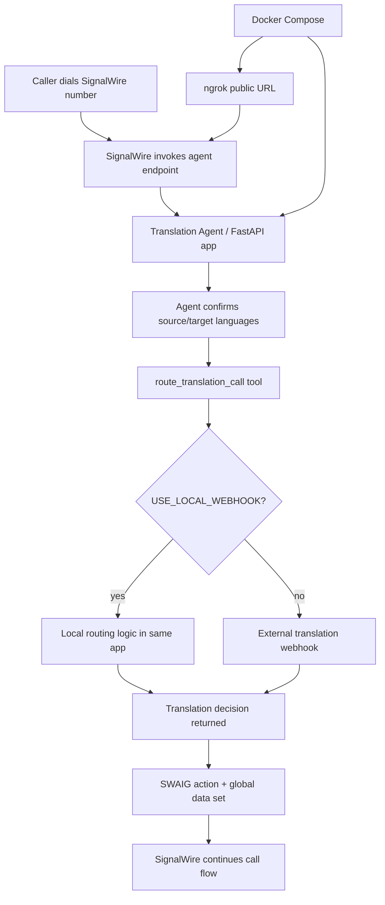

# Real-Time-Translation-AI-Agent

Real-time translation AI agent orchestrator built with Python, `uv`, FastAPI, and the SignalWire Agents SDK.

## MVP shape

For the MVP, everything runs in one backend service:

- SignalWire-facing agent endpoint
- local webhook decision logic inside the same backend
- routing/orchestration logic
- structured logs
- optional ngrok tunnel via Docker Compose

This keeps the first demo simple while preserving a clean contract for splitting services later.

## High-level flow


```

## What this app does

- exposes a SignalWire-compatible agent endpoint
- answers incoming calls through SignalWire Agents SDK
- confirms source and target languages
- triggers a translation-routing tool (`route_translation_call`)
- calls local in-process webhook logic for routing decisions by default
- can later call an external webhook without changing the SignalWire-facing contract
- logs routing decisions clearly for debugging/demo purposes

## Endpoints

- `GET /health`
- `GET /ready`
- `GET /` → SWML document (basic auth required)
- `POST /swaig` → SWAIG tool calls (basic auth required)

## Local development

```bash
uv sync
cp .env.example .env
uv run python -m real_time_translation_ai_agent.main
```

## Docker Compose

```bash
cp .env.example .env
# fill in SIGNALWIRE_TOKEN and NGROK_AUTHTOKEN
docker compose up --build
```

That starts:
- the backend on port `3000`
- ngrok on port `4040` for the local inspection API

To inspect the public ngrok URL:

```bash
curl -s http://localhost:4040/api/tunnels | jq
```

Use the resulting `https://...ngrok...` URL as the public base URL for SignalWire.

## Example calls

### Fetch SWML

```bash
curl -s -u signalwire:dev-password-change-me http://localhost:3000/ | jq
```

### Call SWAIG routing tool

```bash
curl -s http://localhost:3000/swaig \
  -u signalwire:dev-password-change-me \
  -H 'content-type: application/json' \
  -d '{
    "function": "route_translation_call",
    "call_id": "demo-call-123",
    "argument": {"raw": "{\"source_language\":\"en-US\",\"target_language\":\"es-ES\"}"}
  }' | jq
```

## Logging

Supported log env vars:

- `LOG_LEVEL=DEBUG|INFO|WARNING|ERROR`
- `LOG_FORMAT=pretty|json`

`pretty` is nicer for local development.
`json` is better for ingestion in hosted environments.

## Recommended MVP env

```env
SIGNALWIRE_SPACE=webrtcventures.signalwire.com
SIGNALWIRE_PROJECT=3e85ab51-d514-409d-bfcd-211997ae7fbb
SIGNALWIRE_TOKEN=...
SWML_BASIC_AUTH_USER=signalwire
SWML_BASIC_AUTH_PASSWORD=<strong-password>
NGROK_AUTHTOKEN=...
USE_LOCAL_WEBHOOK=true
DEFAULT_SOURCE_LANGUAGE=en-US
DEFAULT_TARGET_LANGUAGE=es-ES
```

## Architecture note

Current recommendation for MVP:

- SignalWire handles call/media infra
- this service handles orchestration
- the translation routing contract currently lives as local in-process webhook logic
- later we can move that same contract into a separate HTTP webhook service if needed
